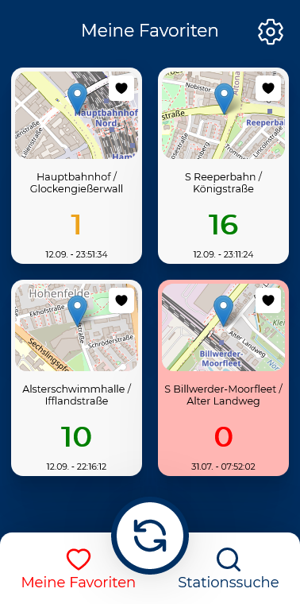
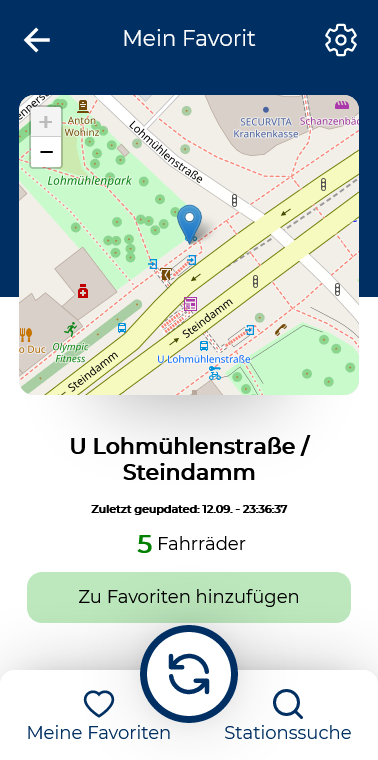

<!-- PROJECT LOGO -->
<br />
<p align="center">
  <a href="https://github.com/mpagels/my-stadtrad-favorites">
    
  </a>

  <h3 align="center">My StadtRAD Hamburg Favorites</h3>

  <p align="center">
    This app let you save every StadtRAD station in Hamburg and shows you the available bikes at the saved station.
    <br />
    <a href="http://my-stadtrad-favorites.vercel.app/">Visit & use App</a>
    ·
    <a href="https://github.com/mpagels/my-stadtrad-favorites/issues">Report Bug</a>
    ·
    <a href="https://github.com/mpagels/my-stadtrad-favorites/issues">Request Feature</a>
  </p>
</p>

<!-- TABLE OF CONTENTS -->
<details open="open">
  <summary><h2 style="display: inline-block">Table of Contents</h2></summary>
  <ol>
    <li>
      <a href="#about-the-project">About The Project</a>
      <ul>
        <li><a href="#features">Features</a></li>
        <li><a href="#built-with">Built With</a></li>
      </ul>
    </li>
    <li>
      <a href="#getting-started">Getting Started</a>
      <ul>
        <li><a href="#installation">Installation</a></li>
      </ul>
    </li>
    <li><a href="#contributing">Contributing</a></li>
    <li><a href="#license">License</a></li>
    <li><a href="#contact">Contact</a></li>
<li><a href="#acknowledgements">Acknowledgements</a></li>
  </ol>
</details>

<!-- ABOUT THE PROJECT -->

## About The Project







I recently found out that my hometown has these internet of things api which gives back the information of the StadradHH service. In the last time I'm using the bike service quite often and the offical booking app did not provide a "save your favorite station" feature. And the officeal app is sometimes not showing the availables bikes.

Right now the `my-stadtRAD-favorite` app let you search for every bike station in Hamburg and let you save it as a favorite. React-query is updating the data when you come back to the app or you click the refesh button.

The IOT api is quite big and powerful. To handle all the data I wrote a BFF (backend for frontend) that handles all the necessary fetching and just send the data back to a react frontend that is needed.

The App is deployed on vercel. The express server is served as well with vercel as serverless functions.

### Features

- Find every StadtRAD station in Hamburg
- Inspect every StadtRAD station with map and available bikes
- Every station is updated every 5 minutes
- save StadtRAD station in a favorite list
- See saved stations in a small dashboard (updates automatically)
- save number, when app should show when few bicycles are available
- Internationalization (German/English)

### Built With

- React
- Express as BFF
- react-query
- react-router
- leatlef-react
- dayjs
- styled-components
- lingui-js
- StadtRADHH API

<!-- GETTING STARTED -->

## Getting Started

To get a local copy up and running follow these simple steps.

### Installation

1. Clone the repo
   ```sh
   git clone https://github.com/mpagels/my-stadtrad-favorites
   ```
2. Install NPM packages
   ```sh
   npm install
   ```
3. Work with express.js in local development run express.js server
   ```sh
   npm run api
   ```
4. Start react
   ```sh
   npm start
   ```

## FAQ

#### Q: You said, the stations are updated every 5min, but my station is currently not updated since 30min or more

TL;DR: The station is checked every 5 minutes. But the IOT api is only updating when the stations is reporting any changes in the available bikes. This means, since 30min there was no change in the bike count.

How I understand it is that the IOT api is asking the station every 5min for any new changes since last update.  
Lets asume at 00:00 o'clock there are 5 bikes available at a station. From 00:00 to 00:05 one bike was rented. Now the API ask for a report at 00:05 and the station reports a change of 1 bike less. The api updates.  
From 00:05 to 00:10 there were 2 more bike rents but 2 bikes were also returned. So at 00:10 there are still 4 bikes at the station. Therefore no change in the count. The api is not updated, because no change since last call.

## Contributing

Contributions are what make the open source community such an amazing place to learn, inspire, and create. Any contributions you make are **greatly appreciated**.

1. Fork the Project
2. Create your Feature Branch (`git checkout -b feature/AmazingFeature`)
3. Commit your Changes (`git commit -m 'Add some AmazingFeature'`)
4. Push to the Branch (`git push origin feature/AmazingFeature`)
5. Open a Pull Request

<!-- LICENSE -->

## License

Distributed under the MIT License. See `LICENSE` for more information.

<!-- CONTACT -->

## Contact

Martin Pagels - [@MPagels](https://twitter.com/twitter_handlehttps://twitter.com/MPagels) - office@martinpagels.de

Project Link: [https://github.com/github_username/repo_namehttps://github.com/mpagels/my-stadtrad-favorites](https://github.com/github_username/repo_namehttps://github.com/mpagels/my-stadtrad-favorites)

<!-- ACKNOWLEDGEMENTS -->

## Acknowledgements

- [StadtRAD Hamburg API Infos](https://metaver.de/trefferanzeige?docuuid=D18F375E-FA5F-4998-AFF8-557969F44479#)
- [API Doc](http://docs.opengeospatial.org/is/15-078r6/15-078r6.html)
